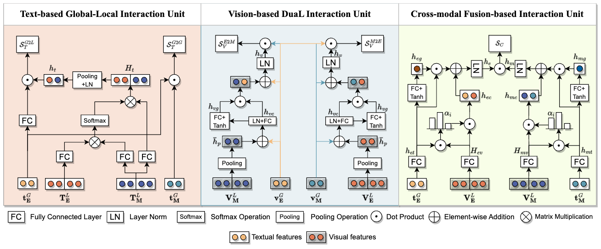

# Multi-Grained Multimodal Interaction Network for Entity Linking

This repository is the official implementation for the paper titled "Multi-Grained Multimodal Interaction Network for Entity Linking". 


<p align="center">
  
</p>


## Usage

**Step 1: Set up the environment**

We recommend using Conda to manage virtual environments, and we use Python version 3.8.12.
```bash
conda create -n mimic python==3.8.12
conda activate mimic
```

Please install the specified versions of Python libraries according to the requirements.txt file.

Note that the versions of PyTorch, Transformers, and PyTorch Lightning may have a slight impact on the results. To fully reproduce the results of the paper, we recommend installing the specified versions.


**Step 2: Download the data**

You may download WikiMEL and RichpediaMEL from https://github.com/seukgcode/MELBench and WikiDiverse from https://github.com/wangxw5/wikiDiverse.

We are still working on cleaning up the off-the-shelf data. Please stay tuned for updates.

**Step 3: Modify the data path**

Please modify the configuration files under the "config" directory (including the YAML files for all 3 datasets) and replace "YOUR_PATH" in the "data" field of each configuration file with the path to your corresponding dataset.

**Step 4: Start the training** 

Now you can execute bash run.sh <gpu_id> <dataset_name> to begin the training.
```bash
bash run.sh 0 wikimel       # for WikiMEL
bash run.sh 0 richpediamel  # for RichpediaMEL
bash run.sh 0 wikidiverse   # for WikiDiverse
```

## Code Structure
The code is organized as follows:
```text
├── codes
│   ├── main.py
│   ├── model
│   │   ├── lightning_mimic.py
│   │   └── modeling_mimic.py
│   └── utils
│       ├── dataset.py
│       └── functions.py
├── config
│   ├── richpediamel.yaml
│   ├── wikidiverse.yaml
│   └── wikimel.yaml
├── readme.md
├── requirments.txt
└── run.sh
```

## Citation
If you find this project useful in your research, please cite the following paper:
```text
@inproceedings{luo2023mimic,
  title = {Multi-Grained Multimodal Interaction Network for Entity Linking},
  author = {Pengfei Luo and
            Tong Xu and
            Shiwei Wu and
            Chen Zhu and 
            Linli Xu and 
            Enhong Chen},
  booktitle = {{KDD}},
  publisher = {{ACM}},
  year = {2023}
}
```


## Contact Information

If you have any questions, please contact pfluo@mail.ustc.edu.cn.